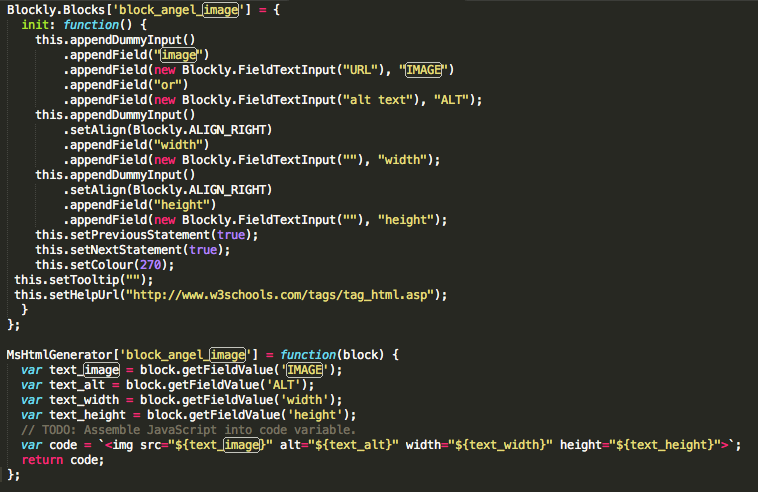
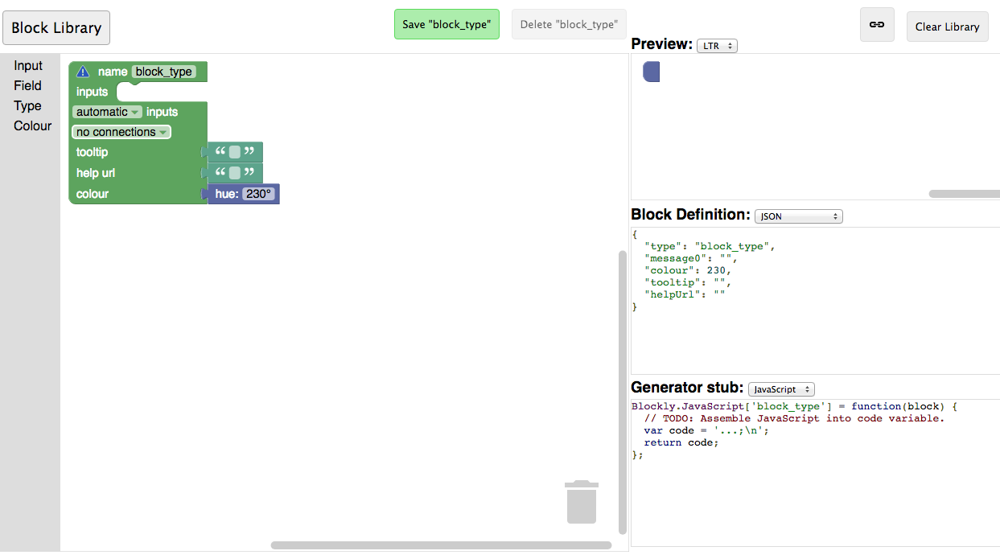
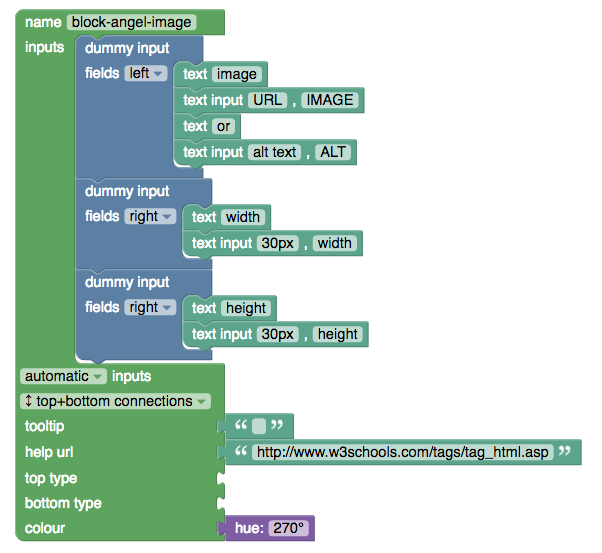

# blockAnatomy


Blocks are basically nothing else than js code. There are two basic functions. The first one is the function that defines the parameters and the view in the UI. The second function generates the code to be used on the HTML page. The example of these two functions are shown below.




### Parametric Fields

Parametric fields are the most flexible part of the blocks. It let the user change the text, color, or the look of the block. For example, the button block has a caption parameter field so that the user can edit it from the UI. Please think about the other users that may want to change something in your block. Of course, the number of the parameter fields cannot be so much. We can not let the user change every part of the block. Please consider not to use parametric fields more than 3 or max 4. This may end with a very complicated, hard to use blocks. You can find in the below **How to develop a block for blockAngel** part for how to make a field parametric.


## How to develop a block for blockAngel

blockAngel can be useful tool unless having lots of reusable blocks. So we need your support for creating new blocks. Please think for others and develop a block that many people need it to use on their web page. Let's do it with an example. Suppose that we want to build a **image tag block**. We will follow the below steps:


### 1- Decide the parametric fields. 

Lets look at a generic HTML image tag below:

```html


```

Decide the parts that you will give the flexibility to be changed from the UI. Give them a variable name.

**Parametric parts:**

- src : text_image
- alt : text_alt
- width : text_width
- height : text_height


### 3- Change the text you want to make parametric with the var name like this.


The HTML code will be:

```html
        


```

### 4- Design your block with block factory

The block factory is a great tool designed by Google engineers. Now we will use this tool to design our block's user interface.
Before using block factory please watch [this video](https://www.youtube.com/watch?time_continue=2&v=s2_xaEvcVI0) on how to use it. It is just 13 minutes :) 

Now let's go to [Google Block Factory](https://blockly-demo.appspot.com/static/demos/blockfactory/index.html) and design our block UI

When you open the block factory you will start with a blank UI like the picture below:




Start with giving the block name. Please read the naming Convention section of this document before.
Let's give this block the name "block-angel-image". Write it at the top.
From the inputs section drag 3 dummy inputs and put it in the input section. Then from the fields section grap the fields like the picture below. 



Now it is time to set the color of our block. Colors are used to visually group the blocks into categories. Blockly uses numbers between 0-360, defining the block's hue in the hue-saturation-value HSV color model. We gave hue:270 to this block.

We all most done. We can copy the Block Definition in Javascript and the Generator stub. Please find them below.

```javascript

Blockly.Blocks['block_angel_image'] = {
  init: function() {
    this.appendDummyInput()
        .appendField("image")
        .appendField(new Blockly.FieldTextInput("URL"), "IMAGE")
        .appendField("or")
        .appendField(new Blockly.FieldTextInput("alt text"), "ALT");
    this.appendDummyInput()
        .setAlign(Blockly.ALIGN_RIGHT)
        .appendField("width")
        .appendField(new Blockly.FieldTextInput("30px"), "width");
    this.appendDummyInput()
        .setAlign(Blockly.ALIGN_RIGHT)
        .appendField("height")
        .appendField(new Blockly.FieldTextInput("30px"), "height");
    this.setPreviousStatement(true);
    this.setNextStatement(true);
    this.setColour(270);
 this.setTooltip("");
 this.setHelpUrl("http://www.w3schools.com/tags/tag_html.asp");
  }
};


Blockly.JavaScript['block_angel_image'] = function(block) {
  var text_image = block.getFieldValue('IMAGE');
  var text_alt = block.getFieldValue('ALT');
  var text_width = block.getFieldValue('width');
  var text_height = block.getFieldValue('height');
  // TODO: Assemble JavaScript into code variable.
  var code = '...;\n';
  return code;
};

```

The code block at the top is the function that defines the block in the UI. The second one is the generator. We need to modify the generator in order to generate HTML code from this block.

After the modification code generator will be like below.


```javascript

MsHtmlGenerator['block_angel_image'] = function(block) {
  var text_image = block.getFieldValue('IMAGE');
  var text_alt = block.getFieldValue('ALT');
  var text_width = block.getFieldValue('width');
  var text_height = block.getFieldValue('height');
  // TODO: Assemble JavaScript into code variable.
  var code = ``;
  return code;
};


```

As you can see we get the parameters from UI and insert it into the HTML. We are returning this HTML code to the system in order to display.


## Naming Convention

### Block Names

block names must start with "block-angel-" prefix. ex: block-angel-image
If it is a css block it must be like :block-angel-css ex: block-angel-css-color

### Block Javascript file name

Starts with lowercase ms prefix followed by the block name ex: msCall_to_action1.js
